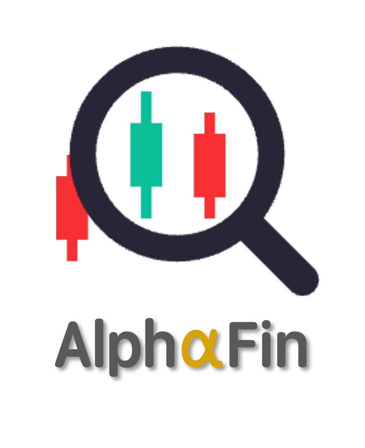
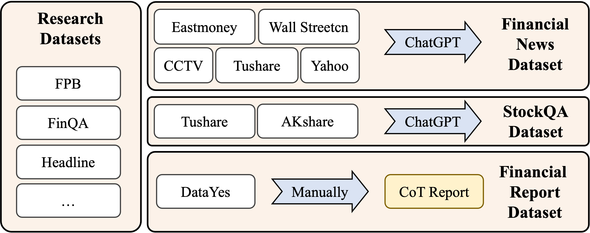
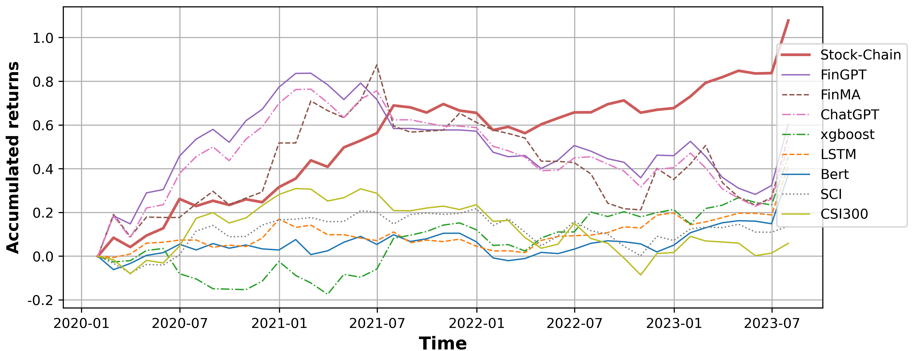
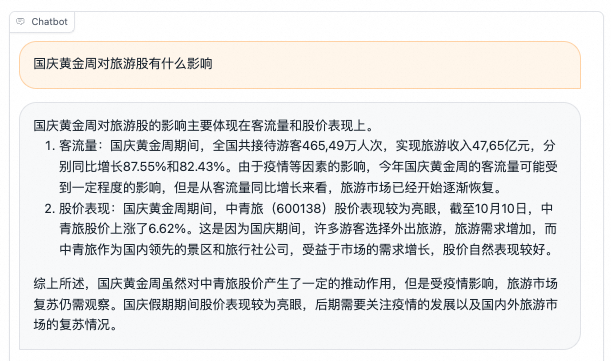

# AlphaFin: Benchmarking Financial Analysis with Retrieval-Augmented Stock-Chain Framework
<p align="center">
    
<p>

## Disclaimer

The content in this repository is for **ACADEMIC RESEARCH AND EDUCATIONAL PURPOSE ONLY**. Although StockGPT provides financial services across a variety of tasks and scenarios, the model should only be used as a reference for the user, and nothing generated by the model should be construed as financial, legal, or investment advice. The authors and contributors are not responsible for the accuracy, completeness or usefulness of the information generated by StockGPT, and users are encouraged to exercise their own judgment and seek professional advice before making any financial, legal or investment decisions. The use of the software and information in this repository is at the user's own risk.

**By using or accessing the information in this repository, you agree to indemnify, defend, and hold harmless the authors, contributors, and any affiliated organizations or persons from any and all claims or damages.**

## Brief Introduction

<p align="center">
    
<p>

We opensource our **AlphaFin** series, now including **AlphaFin dataset**, the chat models trained on AlphaFin, namely **StockGPT-Stage1** and **StockGPT-Stage2**, as well as **Stock-Chain**, the retrieval-augmented financial analysis framework.

We focus on two financial real-world tasks: **Stock Trend Prediction** and **Financial Q&A**. By integrating with RAG, we address the issue of hallucination of LLM’s output and LLM’s inability to generate real-time content.

- [AlphaFin](https://huggingface.co/datasets/AlphaFin/AlphaFin-dataset-v1): contains traditional research datasets, real-time financial data, and handwritten CoT data, enhancing LLM’s ability in financial analysis.

- [StockGPT-Stage1](https://huggingface.co/AlphaFin/StockGPT-Stage1) is LLM fine-tuned with LoRA method on Fin. Reports and Fin. Reports CoT from AlphaFin, which is specialized for stock trend prediction task.

- [StockGPT-Stage2](https://huggingface.co/AlphaFin/StockGPT-Stage2) is continue trained with the research dataset, financial news, and StockQA datasets of AlphaFin, which is more conprehensive and capable of handling financial Q&A task.

## Quick Start

Preparation

```bash
git clone https://github.com/AlphaFin-proj/AlphaFin.git
cd AlphaFin
pip install -r requirements.txt
```

Stage 1

Firstly, download [ChatGLM2-6B](https://huggingface.co/THUDM/chatglm2-6b) and [StockGPT-Stage1](https://huggingface.co/AlphaFin/StockGPT-Stage1) model checkpoints locally. Then, fill in your [tushare api token](https://tushare.pro/) and the local path of these ckpts in `scripts/stage1_trend_prediction.sh`. Finally, execute the following command to run the code

```bash
bash scripts/stage1_trend_prediction.sh
```

Stage 2

Firstly, download [ChatGLM2-6B](https://huggingface.co/THUDM/chatglm2-6b), [StockGPT-Stage2](https://huggingface.co/AlphaFin/StockGPT-Stage2), and [BGE-Large-zh](https://huggingface.co/BAAI/bge-large-zh) model checkpoints locally. Then, specify the local path of these ckpts in `scripts/stage2_financial_qa.sh`. Finally, execute the following command to run the code

```bash
bash scripts/stage2_financial_qa.sh
```

For Stage 2, we provide 200 sample data of news, research report and stock price documents for you to try this project, and more document data will be opened in this project as soon as possible after it is sorted out.

## Dataset

<p align="center">
    
<p>

Data source and preprocessing of the proposed AlphaFin datasets is shown in the figure. We ensure that our dataset covers a wide range of core financial analysis tasks, including NLI, financial QA, stock trend predictions, and so on. AlphaFin contains both Chinese and English datasets to eliminate potential linguistic biases. The English data primarily encompasses traditional financial and NLP-related tasks, while the Chinese data mainly contains financial research reports and stock predictions.

| Dataset | Size | Input Len.  | Output Len. | Lang. |
| - | - | - | - | - |
| Research | 42K | 712.8 | 5.6 | en |
| StockQA | 21K | 1313.6 | 40.8 | zh |
| Fin. News | 79K | 497.8 | 64.2 | zh |
| Fin. Reports | 120K | 2203 | 17.2 | zh |
| Fin. Reports CoT | 200 | 2184.8 | 407.8 | zh |


## Performance

<p align="center">
    
<p>

Our Stock-Chain achieves the highest AR and maintains an upward trend, starting from 2023. It indicates the effectiveness of Stock-Chain in investment. Stock-Chain achieves the highest 30.8% of ARR demonstrating its effectiveness.

## Financial Q&A Cases



## Citation

If you use AlphaFin in your work, please cite our paper.

```
@misc{li2024alphafin,
      title={AlphaFin: Benchmarking Financial Analysis with Retrieval-Augmented Stock-Chain Framework}, 
      author={Xiang Li and Zhenyu Li and Chen Shi and Yong Xu and Qing Du and Mingkui Tan and Jun Huang and Wei Lin},
      year={2024},
      eprint={2403.12582},
      archivePrefix={arXiv},
      primaryClass={cs.CL}
}
```
